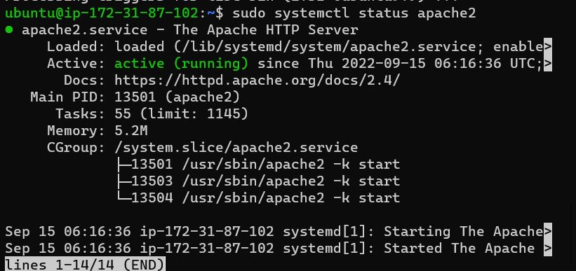
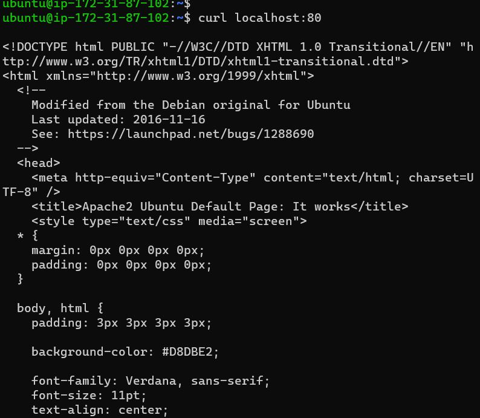
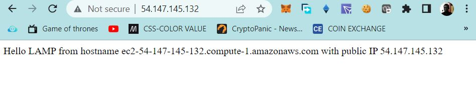
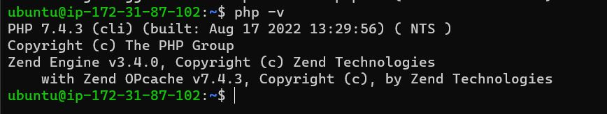
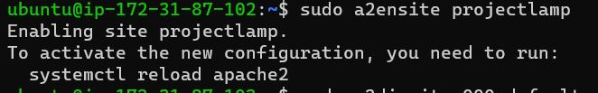
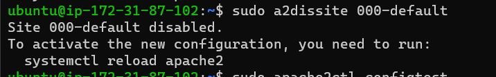
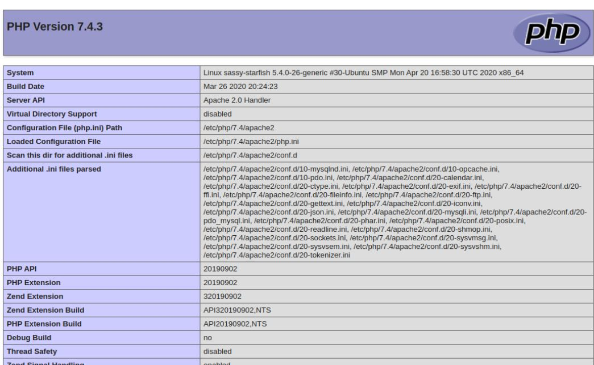

# AWS LAMP STACK IMPLEMENTATION
 ## **This project shows how to implement LAMP**(Linux-Apache-Mysql-Php) on AWS

 ## .......................................Installing Apache......................................
--- 
 update a list of packages in package manager

 `sudo apt update`

run apache2 package installation

 `sudo apt install apache`

Verify apache2 is running

`sudo systemctl status apache2`



verify apache webpage is accessible from the server

`curl http://localhost:80
or
 curl http://127.0.0.1:80`

 To get the ipv4 address of the server run the below command

 `curl -s http://169.254.169.254/latest/meta-data/public-ipv4`

 

 Lets Confirm the webserver is reachable from the outside network by running the below url on a web browser.

 `http://<Public-IP-Address>:80`

 

 
 ## .................................... Installing MSQL........ ........................
 --- 


Install Mysql on the ubuntu server.

 `$ sudo apt install mysql-server`

Log into the Database

`sudo mysql`

configure a database user on and set login password for Mysql

`ALTER USER 'root'@'localhost' IDENTIFIED WITH mysql_native_password BY 'PassWord.1';`

Exit the shell with `Exit`

Start MYSQL Interactive script, this will prompt you to configure the validate password plugin.

`$ sudo mysql_secure_installation`

Confirm ability to login to Mysql by running the commmand.

`$ sudo mysql -p`

To exit the MySQL console, type:

`mysql> exit`

## ....................................... Installing PHP ...........................................
---

we will install 3 packages namely php, libapache2-mod-php, php-mysql. run this command to install all packages listed.

`sudo apt install php libapache2-mod-php php-mysql`

Confirm the php version

`php -v`



At this poinnnt we have successfully installed all 4 applications that make up the lamp stack

- [x] Linux
- [x] Apache Http Server
- [x] MySQL
- [x] PHP

## Setting up virtual host

we will setup a virtual host to test the PHP script, virtual host enables you to setup multiple websites on a single server.

Create the directory for projectlamp using ‘mkdir’ command

`sudo mkdir /var/www/projectlamp`

Next, assign ownership of the directory with your current system user:

`sudo chown -R $USER:$USER /var/www/projectlamp`

create and open a new configuration file in Apache’s sites-available directory.

`sudo vi /etc/apache2/sites-available/projectlamp.conf`

```
<VirtualHost *:80>
    ServerName projectlamp
    ServerAlias www.projectlamp 
    ServerAdmin webmaster@localhost
    DocumentRoot /var/www/projectlamp
    ErrorLog ${APACHE_LOG_DIR}/error.log
    CustomLog ${APACHE_LOG_DIR}/access.log combined
</VirtualHost>
```

list the new file in the sites-available directory.

`sudo ls /etc/apache2/sites-available`

The output of the above command should be similar to this 

```
000-default.conf  default-ssl.conf  projectlamp.conf
```
Thus, we have set /var/www/projectlampl  as the root directory for Projectlamp.

Let us enable the new virtual host with the a2ensite command 

`sudo a2ensite projectlamp`


Disable the default site with a2dissite command

`sudo a2dissite 000-default`


Run the below command to check for syntax errors in the configuration file.

`sudo apache2ctl configtest`

Reload Apache service for changes to take efffect

`sudo systemctl reload apache2`

Create an index file in the projectlamp folder.
```
sudo echo 'Hello LAMP from hostname' $(curl -s http://169.254.169.254/latest/meta-data/public-hostname) 'with public IP' $(curl -s http://169.254.169.254/latest/meta-data/public-ipv4) > /var/www/projectlamp/index.html
```

Go to your browser and try to open your website URL using IP address:

`http://<Public-IP-Address>:80` 

Prefarrably you can also use the DNS name, the port is optional as it defaults to 80. 

`http://<Public-DNS-Name>:80`


## .............................ENABLE PHP ON THE WEBSITE.......................
---

With the default DirectoryIndex settings on Apache, the index.html file takes precedence, lets modify this and give precedence to the index.php file.

We need to edit the /etc/apache2/mods-enabled/dir.conf file and change the order in which the index.php file is listed within the DirectoryIndex directive:

`sudo vim /etc/apache2/mods-enabled/dir.conf`

```
<IfModule mod_dir.c>
        #Change this:
        #DirectoryIndex index.html index.cgi index.pl index.php index.xhtml index.htm
        #To this:
        DirectoryIndex index.php index.html index.cgi index.pl index.xhtml index.htm
</IfModule>
```

Save and close the file, The Apache service needs to be restarted for the changes to take effect.

`sudo systemctl reload apache2`

Create a new file named index.php inside the projectlamp root folder:

`vim /var/www/projectlamp/index.php`

```
<?php
phpinfo();
```
Refresh the webpage to get a display similar to the below screenshot.


It is advisable to remove the file as it contains sensitive information about your server and php site config.

`sudo rm /var/www/projectlamp/index.php`

Thank you!!


